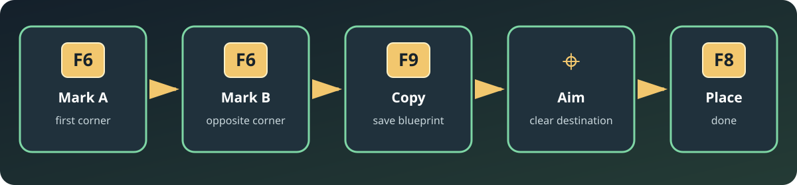

# ShroudEdit

**Copy and paste parts of your Enshrouded world with five keys.**

ShroudEdit is a client-side WorldEdit mod for [Shroudtopia](https://github.com/bonsaibauer/shroudtopia). It can capture a rectangular area containing building blocks, terrain and placeable props such as windows, tables and decorations, then place that blueprint somewhere else.



## What you need

- Enshrouded on Windows
- Shroudtopia 1.1 or newer with its native World API
- The ShroudEdit release ZIP
- A backup of the world you want to edit

ShroudEdit is an experimental world-editing tool. Test new releases in a disposable world before using them on an important save.

## Installation — the easy version

1. Close Enshrouded completely.
2. Install Shroudtopia in the Enshrouded game folder.
3. Download the newest `shroudedit-*.zip` from this repository's Releases page.
4. Extract the ZIP directly into the Enshrouded game folder.
5. Check that this file exists:

   ```text
   Enshrouded/
   └─ mods/
      └─ mod.shroudedit/
         ├─ mod.json
         └─ mod.shroudedit.dll
   ```

6. Start the game. Press **F10** to open the Shroudtopia Debug Console. A successful load contains `ShroudEdit ready`.

## Copy an area

Think of points **A** and **B** as two opposite corners of an invisible box:

```text
          B ●───────────┐
           /           /│
          /  copied   / │
         /   area    /  │
      A ●───────────┘   │
        └───────────────┘
```

1. Aim the building cursor at the first corner and press **F6**. This sets **A**.
2. Aim at the opposite corner and press **F6** again. This sets **B**.
3. Press **F9**. ShroudEdit copies the box and selects the new blueprint.
4. Aim at a clear destination and press **F8** to place it.

The cursor position used by **F8** becomes the blueprint's new anchor. You do not need to place a reference workbench or block first.

## Hotkeys

| Key | Picture | Action |
|---|---:|---|
| **F6** | `A ●` then `B ●` | Mark the two selection corners |
| **F9** | `📋` | Copy blocks, terrain and supported props |
| **F8** | `📌` | Place the selected blueprint at the cursor |
| **F5** | `↶` | Undo the last completed edit |
| **F7** | `⌫` | Clear selection, blueprint, placement plan and undo history |
| **F10** | `≡` | Open the Shroudtopia Debug Console |

Press **F7** only when you really want a fresh start: it also forgets the currently copied blueprint and undo history.

## What is copied?

- Building voxels such as walls, floors and roofs
- Terrain voxels
- Supported placed props, including tested furniture, windows and small table decorations
- Position and rotation of copied props

Containers, crafting queues and other object-specific runtime state are not promised yet. ShroudEdit copies the placed object definition, not necessarily its changing contents. In version 0.2.0, use a clear destination: replacing existing props is not yet reliable.

## Reading the Debug Console

The important messages are intentionally plain:

- `Selection A` / `Selection B`: the two corners were accepted.
- `F9 capture contents`: shows how many occupied voxels and props were copied.
- `Saved world blueprint`: the copy is ready for F8.
- `Native prop verified in entity manager`: a prop really appeared in the game world.
- `F8 placed blueprint`: the complete placement finished.
- `result=...`: the operation failed; do not assume a partial edit succeeded.

Blueprints are stored in `mods/mod.shroudedit/blueprints/`.

## Build from source

```powershell
.\build.ps1 -BuildNumber local
```

The build expects the Shroudtopia repository next to this repository:

```text
A:/Github/
├─ shroudtopia/
└─ shroudedit/
```

Override it with `-ShroudtopiaDirectory <path>` when needed. The script builds the DLL, runs all tests and creates `build/shroudedit-<version>-<build>.zip` plus its SHA-256 checksum.

## Compatibility and support

ShroudEdit intentionally uses Shroudtopia's public World API. Game-specific addresses and native layouts belong in Shroudtopia, not in this mod. After an Enshrouded update, install a compatible Shroudtopia build before testing ShroudEdit.

When reporting a problem, include the ShroudEdit version, Shroudtopia version and the relevant lines from `shroudtopia.log`.

## License

[MIT](LICENSE)
